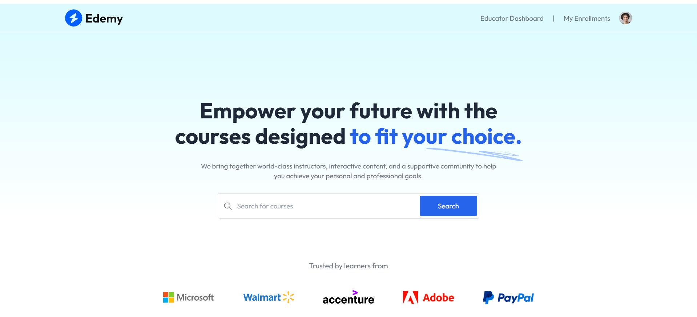
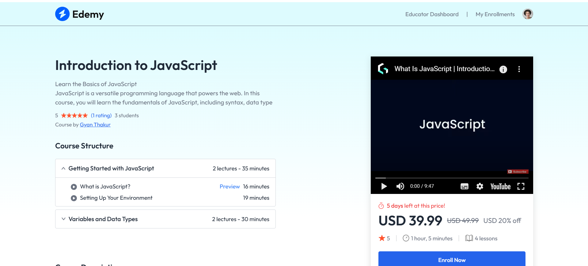
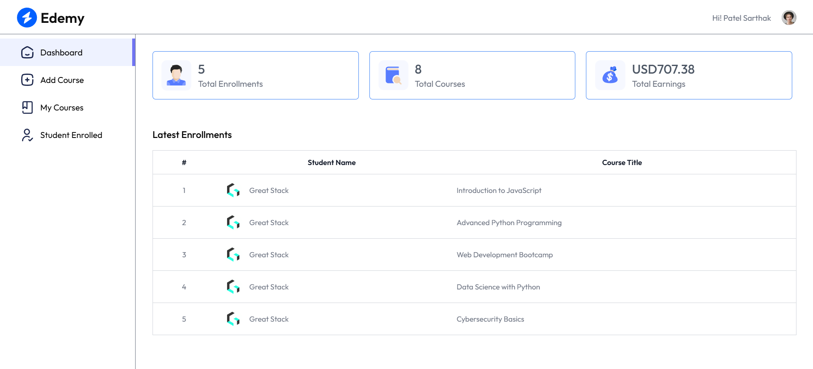
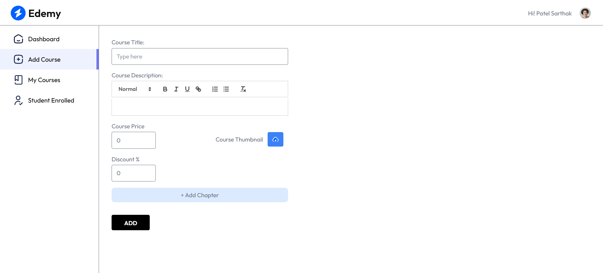
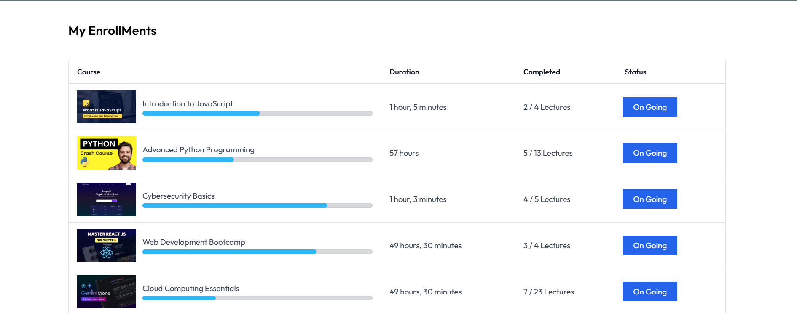
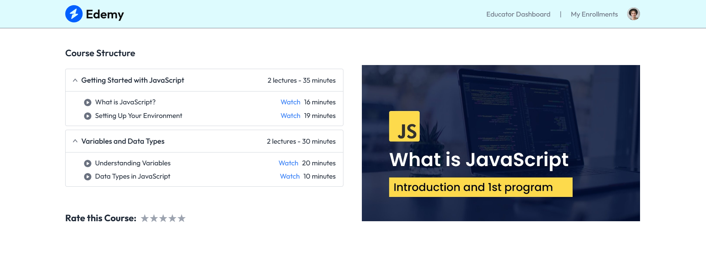
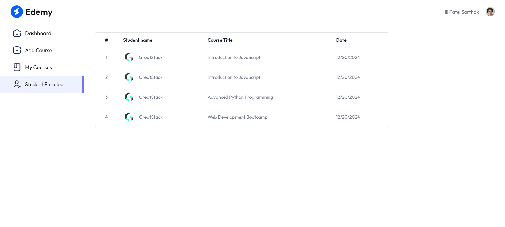

<div align="center">
  


</div>

# Edemy LMS - A Modern Learning Management System


## 📌 Overview
Edemy LMS is a modern Learning Management System (LMS) built using **Vite** for fast performance and efficient development. It provides a seamless platform for students to enroll in courses, watch educational videos, and track their progress.

## 🚀 Features
- 📚 Course Management (Add, Edit, Delete Courses)
- 🎥 YouTube Video Integration
- 👤 User Authentication (Login/Register)
- 📊 Progress Tracking
- 🔍 Search and Filter Courses
- 🌙 Dark Mode Support
- ⚡ Fast and Lightweight (Powered by Vite)

## 🛠️ Technologies Used
- **Frontend:** React.js, Vite, TailwindCSS
- **Backend:** Node.js, Express.js
- **Database:** MongoDB
- **Authentication:** Clerk
- **Deployment:** Vercel / Netlify

## 📥 Installation
Follow these steps to run the project locally:

```bash
# make client folder
mkdir client

# Clone the repository
git clone https://github.com/sArtHak03804/edtech-frontend.git

# Navigate to the project folder
cd demy-frontend

# Install dependencies
npm install

# Start the development server
npm run dev
```


## 📸 Screenshots
| Screenshot | Description |
|------------|------------|
|  | Home Page |
|  | Course Listing |
|  | Course Details |
|  | Video Player |
|  | User Dashboard |
|  | Add Course |
|  | My Course |
|  | Course Progress |
|  | Course Structure |
|  | Students Enrolled |


## 📌 Folder Structure
```
📂 client/
├── 📁 screenshots/
├── 📁 public/
│   ├── favicon.jpg
│   ├── favicon.svg
├── 📁 src/
│   ├── 📁 components/
│   ├── 📁 pages/
│   ├── 📁 assets/
│   ├── App.jsx
│   ├── main.jsx
├── 📄 index.html
├── 📄 package.json
├── 📄 tailwind.config.js
├── 📄 vite.config.js
```

## 📖 Usage
1. Register/Login to access courses.
2. Browse available courses and enroll.
3. Watch video lectures and track progress.
4. Complete quizzes (if implemented) to test knowledge.

## 🎯 Future Enhancements
- ✅ Instructor Dashboard
- ✅ Quiz and Assessments
- ✅ Documents  and Technical assistance 
- ✅ Payment Integration for Paid Courses
## 📜 License
This project is licensed under the **MIT License**.

## 🤝 Contributing
Contributions are welcome! If you find any bugs or have suggestions, feel free to create an issue or submit a pull request.

## 📬 Contact
- **Author:** Sarthak Patel
